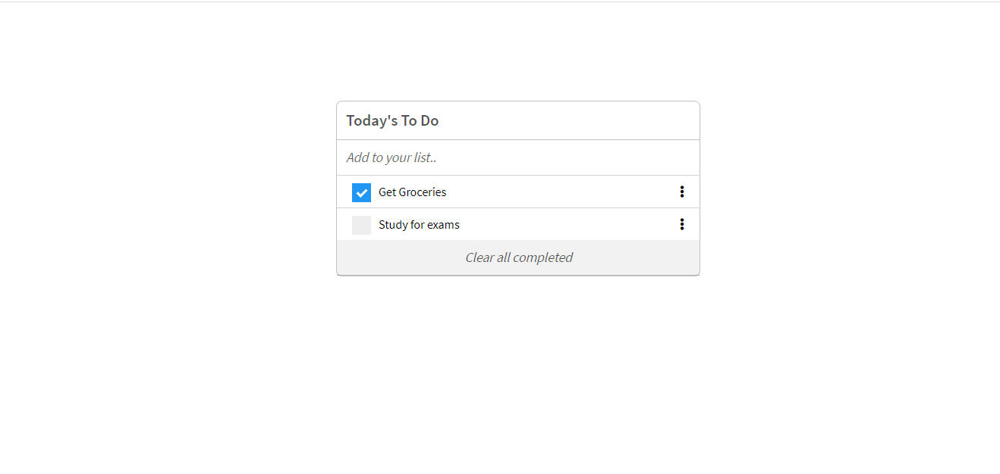

# TodoList

"To-do list" is a tool that helps to organize your day. It simply lists the things that you need to do and allows you to mark them as complete. It is a simple website that allows for doing that, and it is done using ES6 and Webpack!



Additional description about the project and its features.

## Built With

- Javascript
- HTML
- CSS
- Fontawesome

## Live Demo

[Live Demo Link]()


## Getting Started

To get a local copy of the repository please run the following commands on your terminal:

```bash
$ cd <folder>
$ git clone
$ cd into  the cloned repo
$ Open a terminal and 'run npm install'
$ Run the command npm run start
$ Open the dist folder in the root of the app, open the index.html file with a browser(Chrome, Firefox...)
```


## Authors

👤 **Shonibare Adewunmi Comfort**

- Github: [@Adewunmi97](https://github.com/Adewunmi97)
- Twitter: [@_ShonibareC](https://twitter.com/_ShonibareC)

## 🤝 Contributing

Contributions, issues, and feature requests are welcome!

Feel free to check the [issues page](issues/).

## Show your support

Give a ⭐️ if you like this project!


## 📝 License

This project is [MIT](lic.url) licensed.